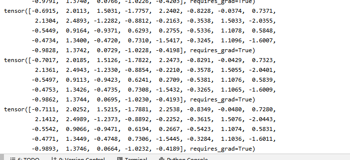
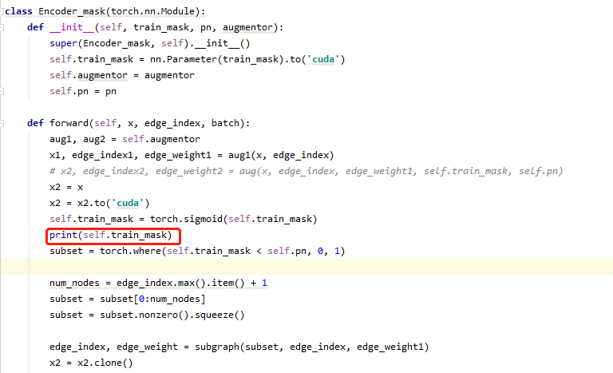
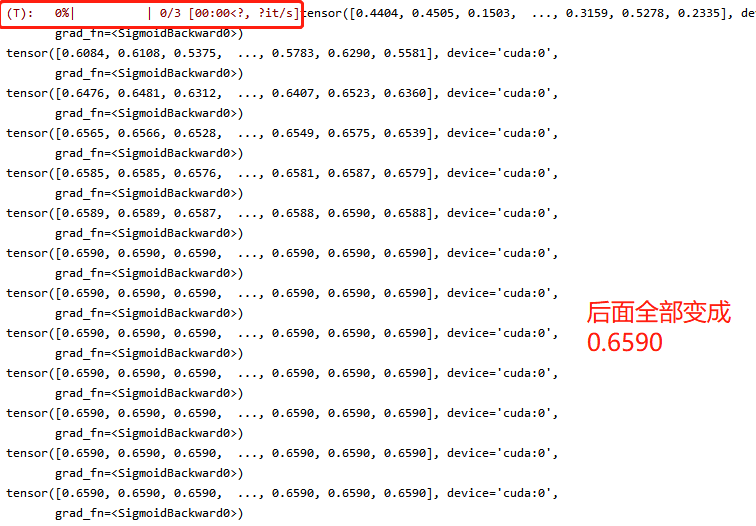
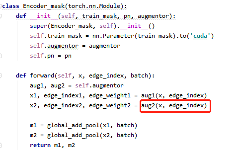
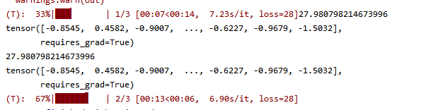

## 代码问题记录

### feature_mask

今天改动了一下代码，好像可以训练了，具体训练情况还没有实验，看起来似乎是训练起来了。

mask在改变，同时loss也在减小。
### node_drop

1.运行PyGCL/node_gcl.py

想通过定义Encoder_mask来达到训练目的，但是print(train_mask)，发现同一个batch中的每一个x上用的train_mask都是由上一个数据的train_mask来的：

结果如下：

（也就是说这一方法应该是不对的）

2.运行PyGCL/node1.py
不同在于Encoder_mask的定义：

aug2参考GCL/augment/node_dropping以及GCL/augment/functional中的drop_node

上次上课老师指出问题：没有让drop比例值pn为可训练的，可能是由于这个造成无法训练，但是也想请老师看看我functional中的drop_node
的代码以及生成子图的方式有没有问题~

###2023.4.3更新
重写了node_drop和fature_mask，全部都单独定义为nn.Module，并且按照周六上课所说，加入了argparse模块来调参
文件：node_drop_divide.py